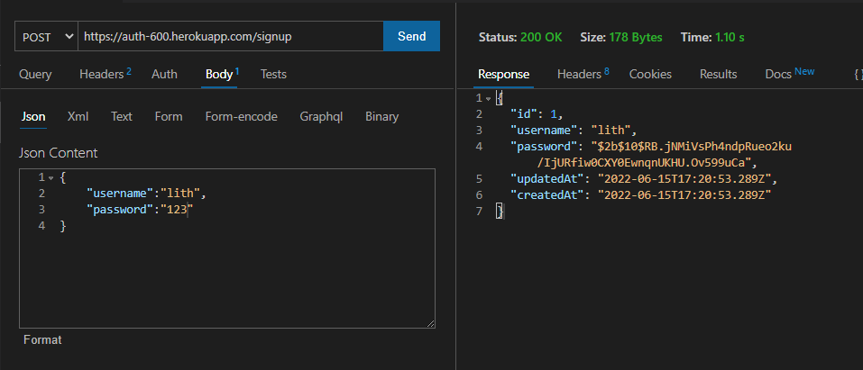
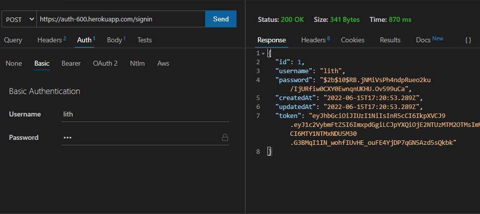
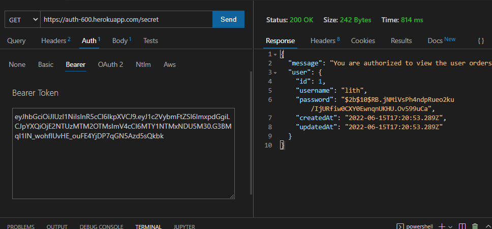
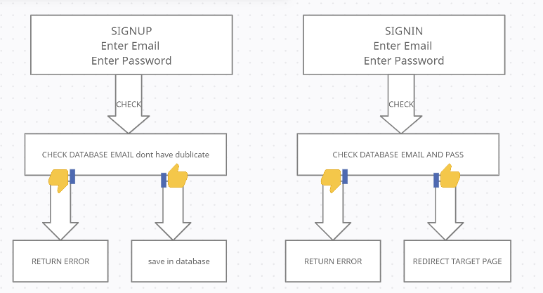

# basic-auth

## 🚀 heroku link 
https://auth-600.herokuapp.com/
## 🚀 project link
https://github.com/lithhalim/basic-auth
## 🚀 pull request
https://github.com/lithhalim/basic-auth/pulls
## 🚀 action
https://github.com/lithhalim/basic-auth/actions

## how use
#### signup

#### signin

#### authrization

## test 

## UML 

## UML 

## DECMUNTATION

- Create a new repository basic-auth
- Make a POST request to the/signup route with username and password
- Make a POST request to the /signin route
- Keep your authentication related files in a folder called /auth so they are independent of the server itself.
- CRUD Operation: Destroy
- CRETE AUTHINTICATION SECTION BY USE SIGN IN SIGN UP 

#### Implementation Notes
 ###### REMINDER: Your app needs a new dependency today: sequelize
 - npm i sequelize sequelize-cli pg sqlite3
 - Remember to start your Postgres server:

